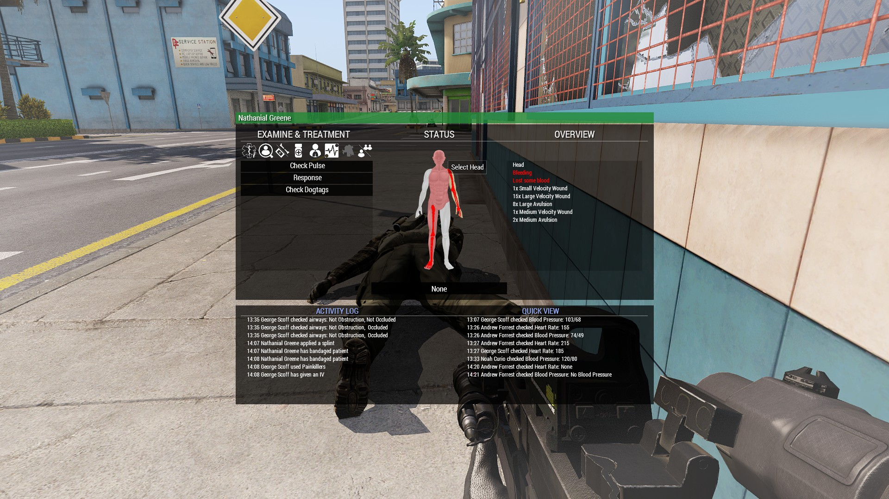

# Combat Aid Guide

## Role Description

Combat Aid is taught to all riflemen, as a way to perform basic medical on their buddy and/or nearby teammates.

Combat Aid covers basic medical, such as wound treatment, and stabilizing; as well as airway management.

## Specialized Equipment

All rifleman are to carry a set of basic medical equipment, consisting of:
* 10x Bandage (Elastic)
    Elastic Bandages are the fastest bandages to apply but have a high chance of the wound reopening
*  5x Bandage (Quik Clot)
    Quick Clot Bandages have the lowest chance of the wound reopening but take longer to apply than Elastic Bandages
*  4x Tourniquet
    Tourniquets are used to stop a limb from bleeding, they can be removed after the patient has been stitched by a Medic
*  2x Splint
    Splits are used to fix fractures; a fracture of the legs causes the patient to limp, whereas a fracture of the arm causes the patient to sway heavily while aiming
*  2x Guedel tube
    Guedel tubes are used to manage airways and allow the patient to breathe
*  2x Painkillers
    Painkillers are used to manage pain, they cannot be taken within 5 minutes of each other and take 1-2 minutes to take effect

## UI

When treating yourself or another, it is highly reccomended to use the Medical Menu accessible by pressing `H` instead of using the ACE interaction menu.

Colors and icons that appear on the paper doll represent:
* Light yellow to dark red: bleeding wound(s), darker means faster bleed rate
* Light blue: stitched
* Red bone: limb is fractured
* Blue line: limb has a tourniquet applied temporarily stopping bleeding

Within the Medical Menu there are 7 tabs under the `Examine & Treatment` tab. These are as follows:
  * View Triage Card
    * Used to view Triage done to patient
  * View Patient
    * Used to check Pulse, Blood Pressure, Dogtags, Response, depending on what body part is interacted with
  * Bandage / Fractures
    * Used to apply Bandages, Splints, Tourniquets, depending on what body part is being interacted with
  * Medication
    * Used for giving a patient medication such as Painkillers, Morphine, Epinephrine, or Adenosine. Painkillers can only be administerd while the head is selected.
  * Airway Management
    * Used to manage a patients airways, covered in `Airway Management`
  * Advanced Treatment
    * Used to perform CPR on an unconcious patient
  * Drag / Carry
    * Used to either Drag or Carry the unconcious patient
  * Toggle (Self/Other)
    * Used to toggle Medical Menu between Self and other patient

## Usage

Performing aid can be broken down into the acronym ABC, standing for Airway, Breathing, Circulation.
  * Begin by performing [Airway Management](###airway-management) to remove any obstructions
  * Follow with ensuring their airways are clear by insering a guedel tube
  * Lastly perform [Wound Treatment](###wound-treatment) and, if instructed, perform CPR.

As a rifleman providing aid, once a Medic is on site if you are not instructed to perform an act of medical then it is no longer your responsibility.

### Airway Management

Managing airways is crucial to keeping your partner alive until the dedicated Medic(s) can arrive. Managing airways consists of:
  * Checking the patients airways (using Check airways)
    * The airway can be in one of three states:
      * No obstruction, No occlusion
      * Obstructed, no occlusion
      * Obstructed, occluded
    * If airway management is needed/occluded a guedel tube must be inserted
    * A guedel tube cannot be inserted if the airways are obstructed, turn the head (Head turning) until the obstruction is removed

  The airways of a patient must be checked often, if an occlusion appears at any point you must repeatedly turn the head (Head turning) to clear the obstruction

### Wound Treatment

The primary purpose for Combat Aid is to quickly treat each other's wounds during combat, or keeping your buddy alive until the designated Medic(s) can arrive.

  * The primary responsibility during combat is to return fire, unless your teammate is fatally wounded and needs immediate care return fire
  * If immediate fire is not needed you must first assess your teammate within the Medical Menu
  * After assessing your teammate administer treatment in the following order:
    * Tourniquet darker colored limbs without tourniquets
    * Once all dark colored limbs are tourniqueted begin to bandage the torso and head; starting with whichever is colored darker
    * Note: Quick Clots have the lowest chance of the wound reopening, while Elastic Bandages are applied much quicker
    * Afterwards begin bandaging remaining limbs, the section will turn white once no more bandaging is needed
    * Splits may be applied at this time if teammate is conscious
    * Lastly call for a Medic to complete medical treatment

### MIST Report

A MIST report is used to quickly convey the status of a downed teammate to the medic on site.

* **Mechanism**: What was the cause of injury; Speed, Mass, Height, Restraints, Number/Type of collisions, Weapon Type
* **Injuries**: What injuries have been caused; Backblast, Grenade, Bullet Wounds, etc.
* **Symptoms and Vitals**: Current status of the patient; Heart Rate, Blood Pressure, Airways, etc.
* **Treatments**: What aid has been applied; Bandages, Tourniquet, Splints, etc.