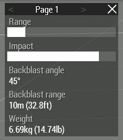

# Light Anti-Tank Guide

## Role Description

An LAT rifleman is a semi-specialized operator class, and is not considered a standard operator. It can only be combined with the following specialized roles:

- Marksman
- Leadership

The primary role of the LAT rifleman is to eliminate light vehicle threats.

## Specialized Equipment

Completing the certification for LAT Rifleman will unlock the ability to operate LAT weapons. The standard LAT weapons used by LAT rifleman are the M72A6 and M136.

## Usage

### Backblast

Every rocket has a blackblast zone behind the launcher. This area needs to be clear before discharging an LAT weapon. You can see the backblast angle and range in the ACE arsenal stats.

The area needs to be clear of any people or large obstructions. Do not fire the weapon while against a wall or other structure that will redirect the overpressured air back towards you.

### Callouts

When you begin to prepare the weapon you must make a callout of "Clear Back - [Direction]". The direction should be the direction the rocket will be moving toward. Hold until you hear "Clear Clear Clear". Once ready call "Rocket out" then discharge the weapon. If you will not be discharging the weapon yell "Cancel Cancel Cancel".

Examples

> *LAT*: Clear back - East
> *Rifleman*: Clear Clear Clear
> *LAT*: Rocket out

> *LAT*: Clear back - North West
> *Rifleman*: Clear Clear Clear
> *LAT*: Cancel Cancel Cancel, vehicle moved away
