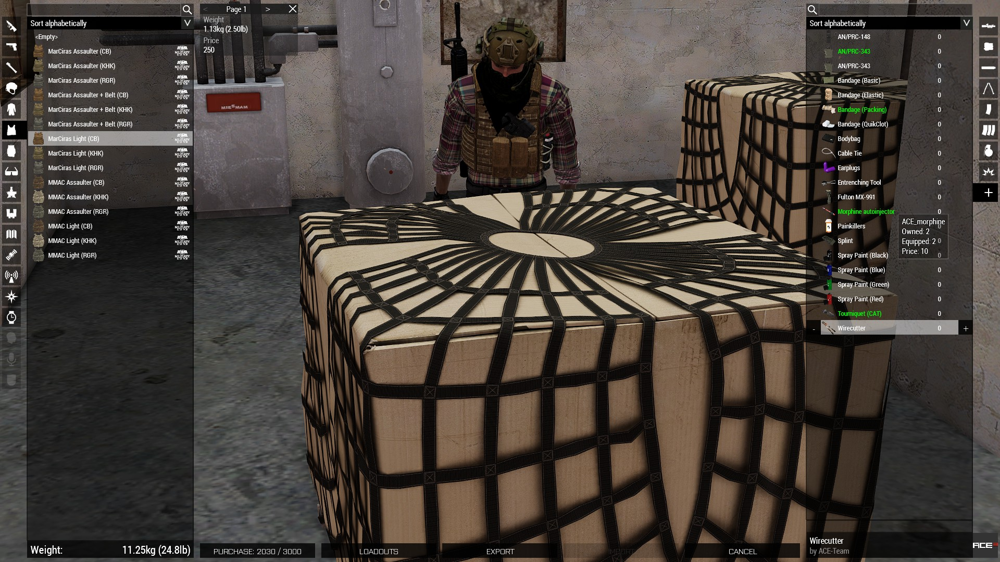
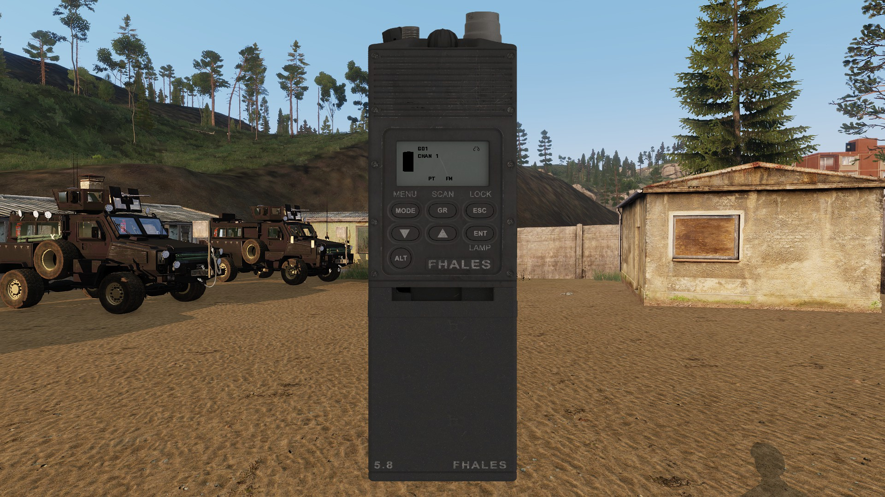
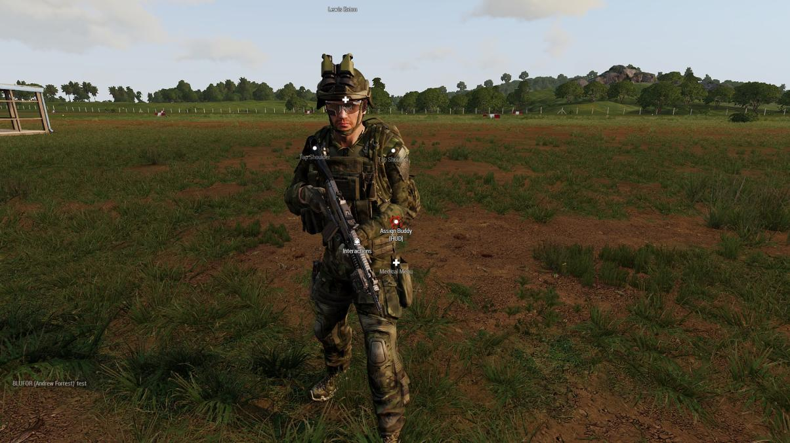

# Your First Operation 

## Names 
Before you jump into a game, you'll first need to set your Arma name to set your discord name. This is done using the profile menu or through Swifty by adding the 'name="Your Name Here"' parameter to Swifty's Parameters field. Your name should be in a First Last format. 

## Arsenal 
When you first load into an op, and have gotten your brief from the Operation Lead, you'll need to get your equipment from the Arsenal. You do this by using the ACE interact menu on the cardboard boxes with nets over them. Once inside the Arsenal, you may notice a change to the normal Arsenal menu where the bottom left button is gray and shows "Balance 3000" 

 

This button is used to show you your current cash balance. You start with 3000 and will earn more for successfully completing operations. As you go through and select gear, you'll notice the balance changes to not gray and now shows xxx/3000. This is representative of the amount of money you are going to spend to buy gear. 

 

After you press purchase, a new confirmation menu will pop up in the center. This screen will show you everything you are purchasing and give you the option to back out without purchasing. 

 

Afterwards you will want to click apply in the bottom right to ensure the gear you are wearing gets put onto your character like the normal Arsenal. Refer to the SOP for information on required and recommended gear for operations.

## Radio
When you get out of the arsenal, the first thing you'll want to do is setup your radio. Do do that use ACE self interact > radios > PRC-148 > Open  to pull up the radio. Then hover your mouse over the dial at the top and left and right click to switch channels. You will put your radio onto whatever channel your element is supposed to be using for that operation as defined in your briefing. 

 

## Join Team 
After you've setup your radio, refer to your Element Leader or the map for which team color you will be placed in. Then use ACE self interact > Teams > join team [yellow|red|blue|green] as per your Element Leaders direction.

## Buddy 

After you've got your team set, you'll need your battle buddy. Typically they will be your teammate (2 operators per team), however setting them as your buddy just helps you keep track of them in game. You do this by ACE interact on buddy > interactions > Assign Buddy.

