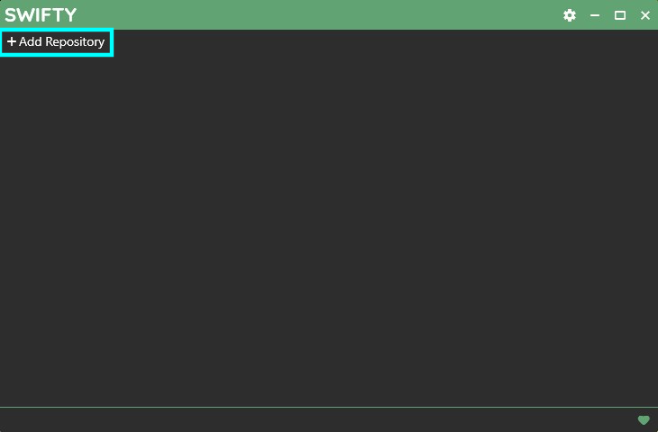
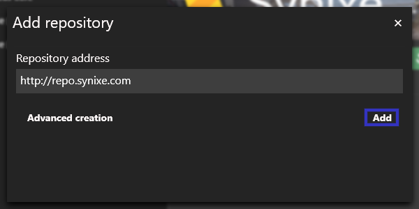
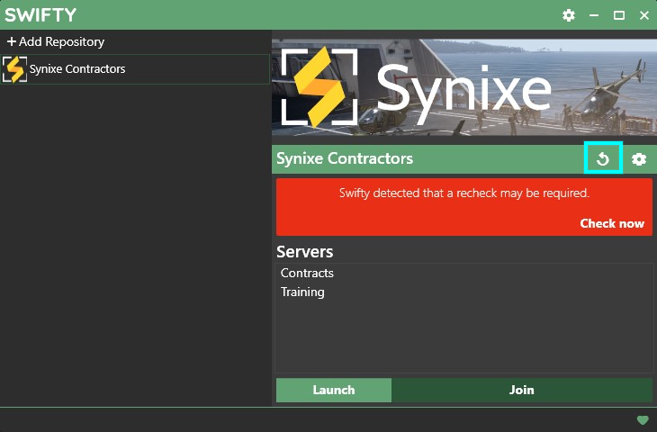
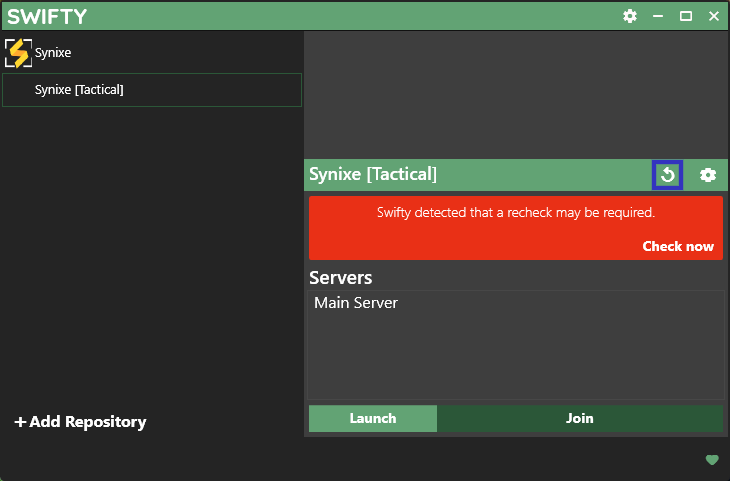

# Mods

If you already have the Synixe mods, skip to step 3. You will need to add a seperate repo, this will not download common mods twice.

## Swifty

1. Download Setup.exe from <https://getswifty.net>

2. Install Swifty

3. Add a repository

4. Enter `https://tac.synixe.com/repo` as the repo address

5. Name the repo `Synixe [Tactical]`, select a folder anywhere on your computer you want the mods to be stored. If you have the Synixe mods, choose the existing folder to avoid downloading the mods twice.

6. Close the Repository Settings window

7. Refresh the repository

8. Hit download after Swifty has fetched all the repository information.
