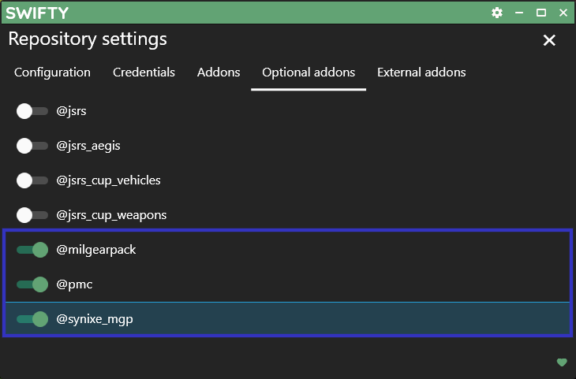
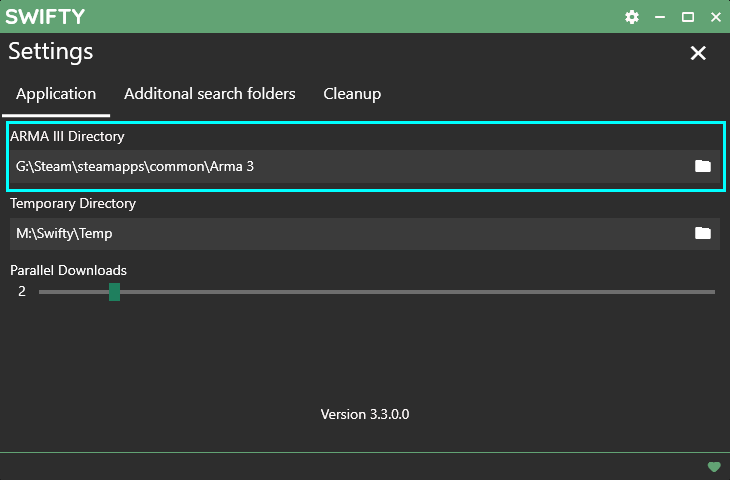

# Mods

## Swifty

1. Download Setup.exe from <https://getswifty.net>

2. Install Swifty

3. Add a repository

4. Enter `https://repo.synixe.contractors` as the repo address

5. Name the repo and select a folder anywhere on your computer you want the mods to be stored.

6. Close the Repository Settings window

7. Refresh the repository

8. Hit download after Swifty has fetched all the repository information.

9. Open the swifty settings

10. Select the folder on your computer where your Arma 3 installation is located

